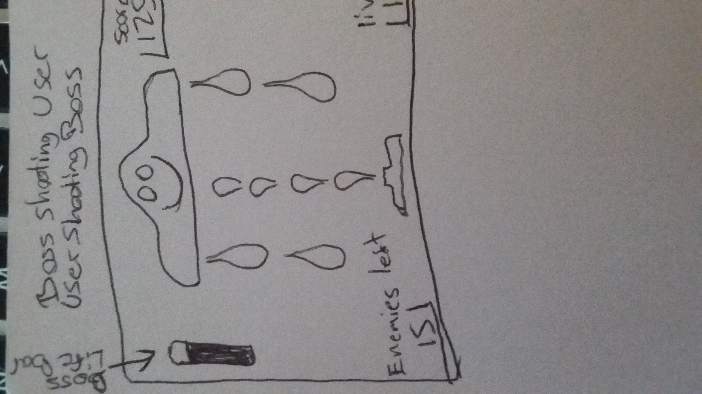
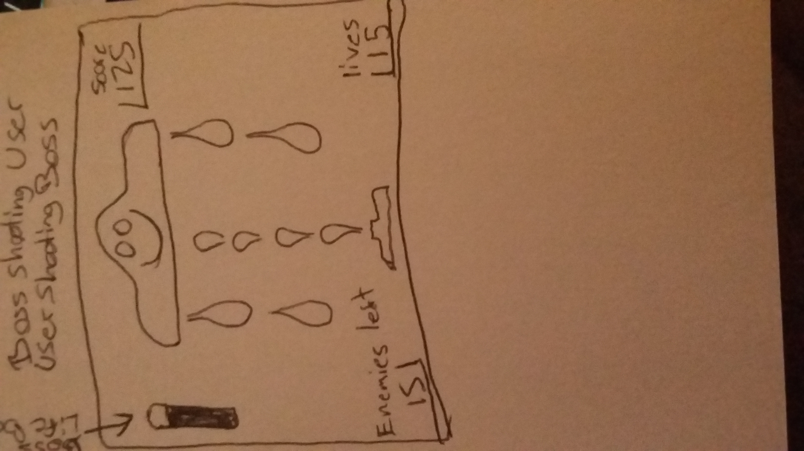
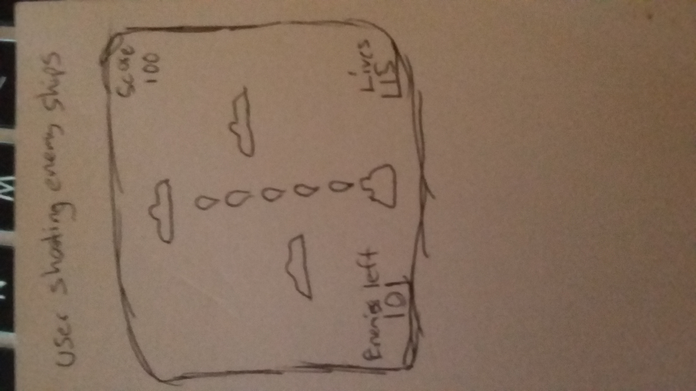

# Space Invaders 2018				

A premature race of beings mysteriously came into possesion of highly advanced  
technologies. Now they travel the galaxy looking to conquer and control new 	  
worlds. It's up to you to stop them! 

## How To Play

The player can move from left to right using directional pad and fire using the spacebar

Objective: Defeat the level one invasion without letting a certain amount of enemies get passed you, protect your ship!

## Getting Started

Game is hosted on github at https://scrummish.github.io/Video-Game-Project-One/

## Requirements

Game is currently not optimized for mobile play. Check in for version 2 soon!

## Built With

* html - The skeleton of the game using html5 Canvas
* javascript - Used to create all the functionality
* jQuery - Assisted in creating the functionality
* css - Used to style the game

## User Stories

1. User should be able to move players ship from left to right by using the directional keys

2. User should be able to shoot a laser beam by pressing the spacebar

3. User should be able to shoot laser beams as long as the spacebar is held down

4. User should be able to visually keep track of enemies defeated

5. User should be able to visually keep track of available lives

6. User should be able to visually track how many enemies can pass him before game over

7. User should be able to visually keep track of boss ships life

8. User should be able to face an unlimited amount of enemy ships as long as the games in play

9. User should see enemy ships spawn at random places

## Wire Frames

## Versioning

This is version 1 

## Authors

* **Sergio Rocha** - [Sergio Rocha](https://github.com/scrummish)

## Acknowledgments

* Hat tip to google and stackoverflow 
* Inspiration: the classic Space Invaders
